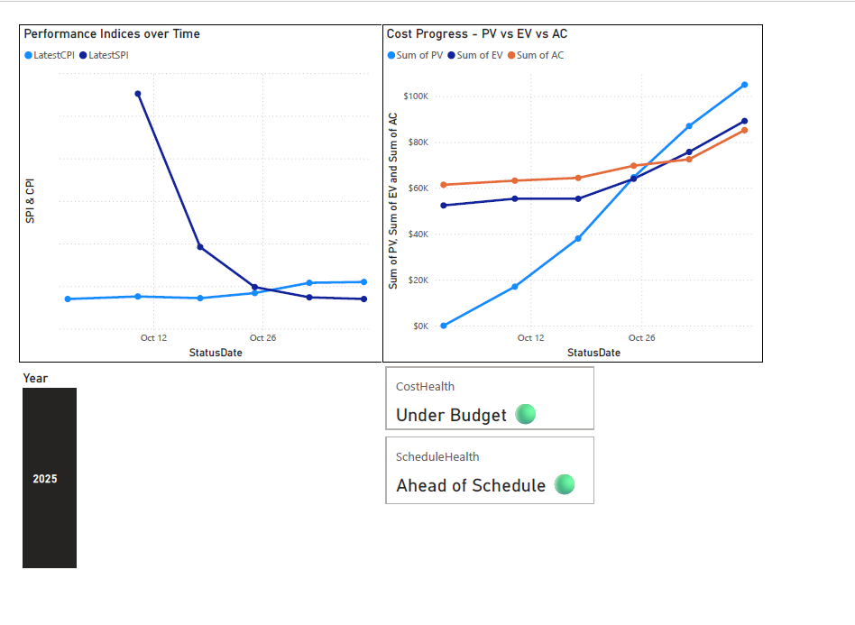

# ⚡ Power Plant Project Controls Dashboard

A data-driven project controls dashboard that simulates Earned Value Management (EVM) for a Bruce Power turbine maintenance project.

Built with Python for data computation and Power BI for visualization, this project demonstrates real-world cost and schedule control analysis — the same principles used across the nuclear and energy sectors.

## 🧭 Overview

This dashboard tracks project performance over time using Earned Value Management (EVM) indicators on dummy project data (simulated for learning purposes only).

It models how nuclear and energy-sector project control teams analyze performance during turbine maintenance and outage work at companies like Kinectrics, Bruce Power or OPG.

### 📈 Key EVM Metrics

| Metric | Description |
|:--------|:-------------|
| **CPI (Cost Performance Index)** | Measures cost efficiency (`EV / AC`) |
| **SPI (Schedule Performance Index)** | Measures schedule efficiency (`EV / PV`) |
| **EAC (Estimate at Completion)** | Forecasts total project cost at completion |
| **VAC (Variance at Completion)** | Expected budget deviation (`BAC - EAC`) |
| **CV (Cost Variance)** | `EV - AC` → positive = under budget |
| **SV (Schedule Variance)** | `EV - PV` → positive = ahead of schedule |

These indicators reveal whether a project is under/over budget or ahead/behind schedule, giving a clear picture of performance health using controlled, synthetic data.

## 🧩 Repository Structure

```text
Project_Controls_Dashboard/
├─ data/
│  ├─ project_data.csv           # Baseline task & cost data (dummy values)
│  ├─ progress_log.csv           # Periodic updates for EV and AC (simulated)
│  ├─ metrics.csv                # Single-date project metrics snapshot
│  └─ metrics_history.csv        # Multi-date performance trends
│
├─ src/
│  ├─ compute_metrics.py         # Calculates PV, EV, AC, CPI, SPI, CV, SV, EAC, ETC, VAC
│  └─ compute_trend.py           # Builds metrics_history.csv from progress logs
│
└─ powerbi/
   ├─ Project_Controls_Dashboard.pbix   # Power BI dashboard file
   └─ Dashboard_Preview.png             # Dashboard preview image
```

## ⚙️ Data Pipeline

The project follows a simple, transparent data-flow architecture:

```text
project_data.csv + progress_log.csv
            ↓
     compute_trend.py  (Python)
            ↓
     metrics_history.csv
            ↓
       Power BI Dashboard
```


1. **Python layer** – `compute_metrics.py` and `compute_trend.py` calculate and compile Earned Value Management (EVM) indicators over time.  
2. **Power BI layer** – imports `metrics_history.csv` to visualize cost and schedule performance.  
3. **DAX layer** – defines measures like `LatestCPI`, `LatestSPI`, `CostHealth`, and `ScheduleHealth` for dynamic KPI cards.

---

## 📊 Dashboard Features

### 1️⃣ KPI Cards
- **CPI**, **SPI**, **EAC**, **VAC** → dynamically calculated from the latest status date  
- **Color-coded indicators** for instant visual feedback  
- **Health summaries**  
  - *CostHealth* → Under / On / Over Budget  
  - *ScheduleHealth* → Ahead / On / Behind Schedule  

### 2️⃣ Trend Visuals
- **CPI & SPI Over Time** → includes a baseline line at 1.00  
- **PV vs EV vs AC Progress** → compares planned, earned, and actual performance  

### 3️⃣ Design
- Professional Power BI layout using gray / green / orange palette  
- Consistent fonts, grid alignment, and clear titles

## 🧠 Key Learnings

Through this project, I learned to:

- Apply **Earned Value Management (EVM)** in a real engineering scenario using dummy data.  
- Use **Power BI DAX** for advanced filtering and KPI logic.  
- Automate data generation using **Python (pandas, datetime, NumPy)**.  
- Communicate technical performance clearly through **visual storytelling**.  
- Bridge the gap between **engineering analysis** and **project controls reporting**.

---

## 🚀 How to Run

1. **Clone this repository**
   ```bash
   git clone https://github.com/mugjeff12/Project_Controls_Dashboard.git
   cd Project_Controls_Dashboard

 2. Open the Power BI dashboard
- Navigate to powerbi/Project_Controls_Dashboard.pbix
- Open it using Power BI Desktop

3. Explore interactively
- Use the Status Date Slicer to filter reporting periods.
- Hover over data points to reveal Cost Variance (CV) and Schedule Variance (SV) tooltips.
-Observe how CPI, SPI, and PV/EV/AC evolve across time.
- Hover over data points to reveal Cost Variance (CV) and Schedule Variance (SV) tooltips.
- Observe how CPI, SPI, and PV/EV/AC evolve across time.

## 🖼 Dashboard Preview

Below is the final Power BI dashboard created for this project, built using dummy performance data.



---

## 🧩 Tools & Technologies

| Category | Tools Used |
|:----------|:-----------|
| **Data Analysis** | Python (`pandas`, `datetime`, `NumPy`) |
| **Visualization** | Power BI Desktop |
| **Modeling** | DAX (`CALCULATE`, `FILTER`, `SWITCH`) |
| **Project Metrics** | Earned Value Management (CPI, SPI, EAC, VAC) |
| **Version Control** | Git, GitHub |
| **Documentation** | Markdown (README.md) |

---


## 💬 Author

**👤 Mugdho Jeferson Rozario (Jeff)**  
🎓 *Engineering Physics (Nuclear), McMaster University*  
📍 Mississauga, Ontario, Canada  

📧 [mugdhojeferson@gmail.com](mailto:mugdhojeferson@gmail.com)  
🌐 [www.mjefersonrozario.com](https://www.mjefersonrozario.com)  
🔗 [LinkedIn](https://www.linkedin.com/in/mugdho-rozario/) • [GitHub](https://github.com/mugjeff12)

